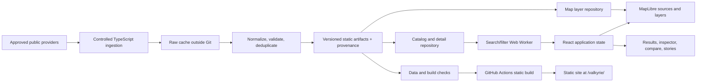

# Technical architecture and command contract

This is Valkyrie's selected design, not a reconstruction of Power Atlas's undisclosed internals.

## 1. Architecture



One Vite application is enough. Ingestion is tooling, not a server. Browser data loading is same-origin and read-only. Provider access and data refresh are separate operations from normal application build/test.

## 2. Selected stack

| Concern | Decision |
|---|---|
| Runtime/build tooling | Node LTS compatible with chosen dependencies; pin exact patch in `.nvmrc`; pnpm exact `packageManager` version |
| UI | React, TypeScript strict mode, Vite |
| Styling | CSS custom properties + CSS Modules; one small accessible primitive library only when it removes real dialog/menu work |
| Icons | A single consistent SVG icon family; no provider or company logos needed |
| Map | `maplibre-gl`, direct integration behind a lifecycle adapter |
| Data schemas | Zod for runtime validation with inferred types |
| Geographic interchange | GeoJSON with [longitude, latitude] ordering; preserve source IDs and precision labels |
| Search | Deterministic local index/filtering in a Web Worker; no remote geocoder |
| UI state | Small feature stores with explicit actions; choose Zustand at foundation, keep domain logic pure |
| Tests | Vitest, React Testing Library, Playwright; axe integration for automated accessibility checks |
| Deployment | Static GitHub Actions build; `/valkyrie/` base; GitHub Pages-compatible artifact |
| Documentation | Markdown, Mermaid, task cards and execution evidence |

Exact package versions are deliberately not guessed. VLK-006 records selected versions, Node compatibility and install/build proof. Prefer current stable compatible versions, not prereleases or arbitrary old pins. Retain one lockfile. No React wrapper for MapLibre is necessary in the baseline.

## 3. Proposed file layout

These are implementation targets; most do not exist in the planning commit.

```text
src/
  app/                 # App composition, providers, feature flags, error boundaries
  components/ui/       # Shared controls, dialogs, sheets, tabs, empty states
  features/
    map/               # MapHost, adapter, layer registry, interactions, camera
    search/            # Palette, query parser, ranking, index worker
    filters/           # Facets, predicate builder, selected filter summary
    results/           # Accessible table/list and pagination
    inspector/         # Record overview, facts, evidence, relationships
    compare/           # Compatible measure comparison
    stories/           # Story player and deterministic transitions
    sources/           # Coverage, licenses, freshness, methodology
    sharing/           # URL codecs and saved views
  domain/              # Schemas, identifiers, units, selectors, evidence rules
  data/                # Manifest and shard loaders; no provider credentials
  workers/             # Pure message-based query work
  styles/              # Tokens, reset, global type, reduced-motion rules
  test/                # Setup and clearly marked fixtures
scripts/
  data/                # Ingest, validate, build, diff, publication tools
  check-plan.mjs       # Planning consistency validation
  check-budgets.mjs     # Artifact/bundle constraints
public/
  data/releases/<id>/  # Approved map, catalog, details, sources and story artifacts
  geography/           # Approved locally served overview geography
  data/current.json    # Immutable release pointer, updated only after validation
  credits/             # Upstream notices required for distributed artifacts
  screenshots/         # Actual release images only when created
config/
  sources.json         # Source registry, terms, pinned inputs, coverage, refresh policy
  regions.json         # Explicit pack extents and labels
  features.json        # Release-gated optional capabilities
  curation/            # Evidence-backed small records and reviewed identity aliases
  sources.lock.json    # Download URLs, source versions and SHA-256 values
.tests-or-tests/       # Use tests/ in implementation; do not create both layouts
```

Use `tests/` for integration/e2e/performance fixtures. Avoid empty package/service directories for hypothetical future architecture.

## 4. Data load sequence

1. Load the tiny version pointer and validate the manifest schema; show recoverable errors if either fails.
2. In parallel load local overview geography, minimal world point geometry, and compact global catalog/search records. Lazy-load MapLibre itself so HTML shell/results are not blocked by GPU initialization.
3. When entering a regional pack, request only that pack's enabled layers and catalog additions. Cancel obsolete loads and reject stale responses using request generation IDs.
4. When selecting an asset, fetch its detail shard by stable source namespace/ID, with a bounded in-memory cache. Reuse pending requests.
5. Load story and compare surfaces lazily. No subscription, analytics, provider ping or refresh request on every pan.

`import.meta.env.BASE_URL` must prefix all local artifact, worker and geography URLs. Do not assume deployment at `/`. Asset URLs in the manifest are release-relative, not absolute filesystem paths.

## 5. Map lifecycle

`MapHost.tsx` creates exactly one map per mounted host and removes it on cleanup. The adapter owns native listeners, layers, feature-state and camera commands. React owns user intent and visible UI. Selection/hover updates do not replace all GeoJSON or recreate the map. Avoid object-identity-triggered source churn.

Layer registry entries contain stable ID, source ID, category, geometry kind, minimum zoom, paint/layout definitions, attribution requirements and supported selection behavior. Re-register required sources/layers after a style reload. Add cluster sources only where meaningful; cluster expansion selects the next zoom rather than an arbitrary individual plant.

World point data may remain as bounded GeoJSON when benchmarks pass. Region line data is split by pack and simplified for display, never used to imply electrical topology. Move to tiled artifacts only after VLK-074 evidence identifies a failing layer.

Current MapLibre documentation includes an ESM worker-specific Vite integration. Verify the chosen installed major's instructions and test workers from the production subpath, not only dev mode. Reference: https://maplibre.org/maplibre-gl-js/docs/ .

## 6. State ownership

- `catalogState`: manifest version, loaded partitions, data health and immutable records.
- `exploreState`: active region/categories, filter expression, selected ID and comparison IDs.
- `viewState`: camera and open panel; keep high-frequency camera values in map refs and publish settled changes only.
- `storyState`: story ID/step/play state and previous explore state for restoration.
- `queryState`: query generation, current results and pending status.
- URL state is a serialized subset of explore/view/story state, not another independent store.

All filtering/metrics use the same pure predicate. Empty filter set means no assets in that category, not all assets by accident. Search matches within the declared search scope and explains when a result is outside current filters; selecting it may offer an explicit reveal action rather than silently changing every filter.

## 7. Command contract

After foundation, the repository must expose these commands. Until then they are requirements, not runnable claims.

| Command | Behavior |
|---|---|
| `pnpm dev` | Start local Vite server with documented port |
| `pnpm build` | Type-safe production assets from committed data; never live ingestion |
| `pnpm preview` | Serve production build and its configured base path |
| `pnpm lint` | ESLint including React/hooks rules |
| `pnpm typecheck` | Strict TypeScript across app and ingestion tools |
| `pnpm test` | Non-watch deterministic Vitest suite |
| `pnpm test:watch` | Explicit watch mode only |
| `pnpm test:e2e` | Playwright against production preview |
| `pnpm test:a11y` | Automated accessibility scenarios plus manual checklist output |
| `pnpm data:validate` | Offline published-artifact schemas, IDs, references, licenses and hashes |
| `pnpm data:ingest -- --source=<id>` | Explicit controlled network ingest; never implicit during build |
| `pnpm data:build` | Offline deterministic transformation of locked cached inputs |
| `pnpm data:diff` | Old/new count, geometry, license, and field-change report |
| `pnpm check:plan` | Task IDs/dependencies/statuses and document-link validation |
| `pnpm check:budgets` | Measured release and bundle limits |
| `pnpm check` | lint + typecheck + test + data:validate + check:plan + build |

A source requiring a key must use a documented environment secret in the ingestion process, never a `VITE_*` secret. Default v1 has no required secret. Unsupported optional input must fail with a useful message, not hang or fabricate a success artifact.

## 8. ADRs and change rules

Decisions ADR-001 through ADR-008 are in `docs/DECISIONS.md`. Changes require a problem statement, measured evidence when performance-driven, alternatives, migration impact, and updated affected tasks. Do not introduce infrastructure because it looks impressive on an architecture diagram.
